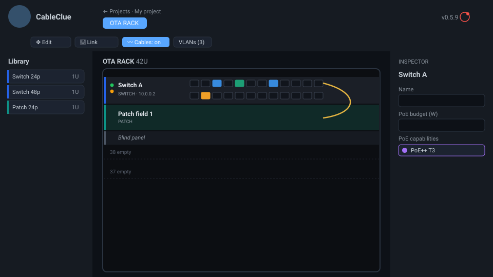
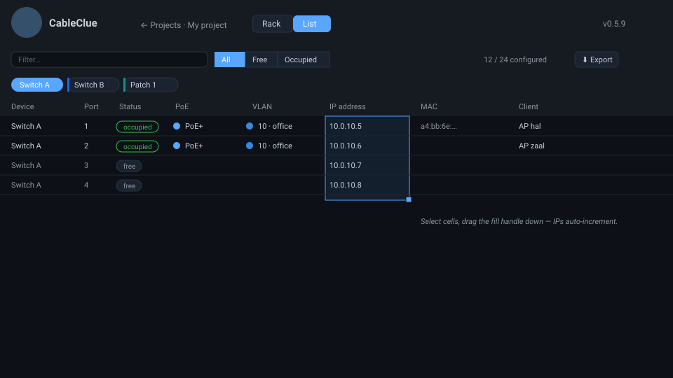

<p align="center">
  
</p>

<h1 align="center">CableClue</h1>

<p align="center">
  A web app to administer racks of network switches and patch panels — visually and as a spreadsheet.<br>
  Part of the <em>Clue</em> family. Ships as a single Docker container.
</p>

---

## What it does

CableClue lets you build racks the way they physically look, then administer the
network on top of them. Every project holds its racks, VLANs, devices, ports,
PoE and links — and the same data is available as a graphical **rack view** and a
spreadsheet-style **list view**.

### Rack view



- **Drag switches, patch panels and blind panels** from the library into rack
  slots (8/24/48-port switches, 24/48-port patch panels, 1U/2U blinds).
- **Realistic SVG faceplates** with RJ45 jacks, status & link LEDs. Hover a port
  for a tooltip; click it to edit; ports are tinted by their VLAN.
- **Edit mode** to drag devices to new U-positions; **Link mode** to draw cables
  between any two ports; a **cable toggle** (hidden cables show an `L` on linked
  ports).
- **PoE capabilities per port** — assign PoE / PoE+ / PoE++ classes visually by
  clicking ports, with a per-switch PoE budget.
- Right-hand **inspector** for the selected device, port or cable.

### List / admin view



- A project-wide, **spreadsheet-style table** of every port — the same data as
  the rack, editable inline.
- **Excel-like editing:** click/drag to select a column range, double-click or
  type to edit, and **drag the fill handle** to copy values or extrapolate a
  series (trailing numbers, **auto-incrementing IP addresses**).
- **Sortable columns**, a text filter, an **All / Free / Occupied** toggle, and
  **device chips** that filter the list to the switches you pick.
- **VLAN colours**, PoE used-vs-capability, link targets, and **export** to CSV,
  Excel or PDF (PDF & Excel carry CableClue branding).

### Projects

- Everything lives inside a **project**; switch projects from a dedicated start
  window. A new project starts empty.
- **Export** a project to a `.cableclue.json` file and **import** it again — as a
  new project or selectively merged (racks and/or VLANs) into an existing one.

### Notifications

- A bell in the header glows red when something needs attention. The first check:
  switches whose summed PoE draw exceeds their configured PoE budget
  (*“Switch X over PoE budget”*).

---

## Run with Docker (recommended)

```bash
docker compose up --build
```

Then open <http://localhost:8080>. Data persists in the `cableclue-data` volume.

## Local development

Two processes — the Express API and the Vite dev server (which proxies `/api`):

```bash
# backend (port 8080)
npm install
npm run dev

# frontend (port 5173, second terminal)
npm --prefix client install
npm run client:dev
```

Open <http://localhost:5173>. The SQLite file lives in `./data/cableclue.db`.

## Configuration

| Variable   | Default                       | Description                        |
| ---------- | ----------------------------- | ---------------------------------- |
| `PORT`     | `8080`                        | Port the server listens on.        |
| `DATA_DIR` | `./data` (`/data` in Docker)  | Directory for the SQLite database. |

## Architecture

- **Frontend:** React + Vite + TypeScript, `@dnd-kit` for drag & drop, `xlsx` /
  `jspdf` for exports.
- **Backend:** Express + `better-sqlite3` (`server.js`, `db.js`).
- **Docker:** multi-stage build — the Vite output is served as static files by the
  same Express process that serves the `/api` routes.
- **Data model:** `projects → racks → devices → ports`, plus project-scoped
  `vlans` and per-rack `cables`. Schema migrations run automatically on startup.

> The screenshots above are illustrative SVG mock-ups of the current UI; replace
> them with real captures in `docs/` whenever convenient.

---

## Changelog

### 0.5.9
- Excel-like **cell selection + fill handle** in the list view, with series
  fill (trailing numbers and auto-incrementing IPs).
- **Device chips are now filters** — click to show only those switches.
- This README, with logo, screenshots and changelog.

### 0.5.x
- **Projects** as the top-level container; project start window with new /
  rename / delete / **import** / **export**.
- **VLANs moved to project scope**; managed from rack or list view.
- **Project export/import** (full or selective merge) via `.cableclue.json`.
- **List / admin view**: editable project-wide port table.
- **PoE**: per-port used standard + per-port capability (assigned visually in the
  rack), per-switch PoE budget, and the **notification bell** with a PoE
  over-budget alert.
- **List export** to CSV / Excel / PDF with branding.
- Rack numbering flipped so **U1 is the top slot**.

### 0.4.0
- **Edit mode** (drag devices to reorder), type-to-confirm **delete** dialog,
  and **light-mode faceplates**.

### 0.3.x
- CargoClue-style **theme** with light/dark toggle, version & GitHub link.
- Right-hand **inspector** panel (replacing pop-ups).
- **Manufacturer / model** catalogue.
- **Switch-to-switch cables** with a bezier overlay.

### 0.1.0
- Initial release: tabbed racks, draggable device library, visual rack with
  per-port VLAN/IP/client, SQLite persistence, Docker packaging.
